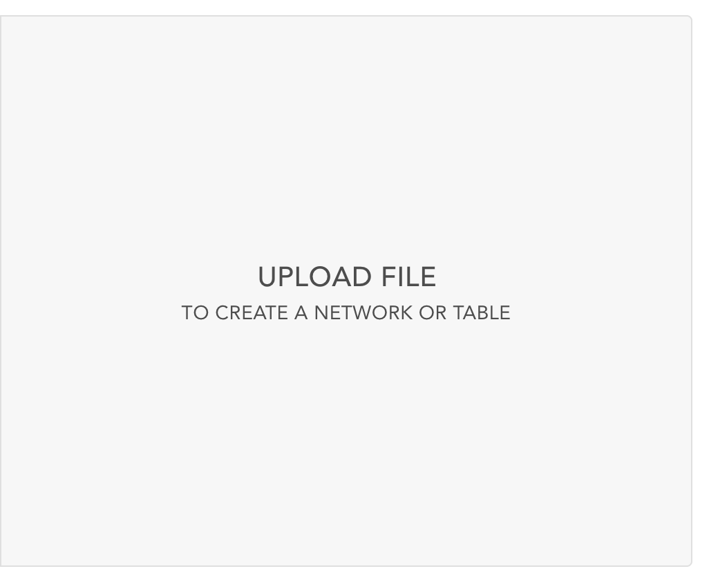
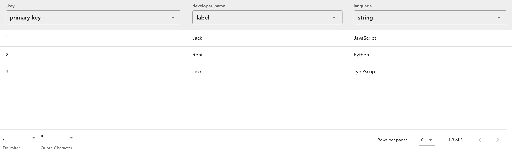

.. _user_documentation:

User Docs
=========

Here is the in-depth user documentation for Multinet. This documentation is
intended to be a comprehensive guide to all of Multinet's features. If you're
looking for a quick start guide, see :ref:`quick_start`.

Log In
------

All operations that mutate data inside Multinet require authentication. This
is a security measure to ensure that only authorized users can modify data, and
to ensure that all changes to data are tracked. Multinet uses Google OAuth2
for authentication, which means that you can use your Google account to log in
to Multinet. If you do not have a Google account, you can create one for free
at `Google <https://accounts.google.com/signup>`_. Our authentication system
ensures that data in your workspaces is only accessible to you and the people
you choose to share it with. To log in, 

1. Click on the person icon next to the multinet logo in the top left corner of
the page.

2. Then click the popover menu button 'Sign in with Google'. This will direct
you to a Google login page. 

3. Enter your Google credentials and
click 'Sign in'.

4. If you have not logged in to Multinet before, you will be asked to authorize
Multinet to access your Google account. Click 'Authorize'. 

5. You will then be redirected back to Multinet where you should see your initials
where the person icon was. This indicates that you are logged in.

Create Workspace
----------------

Multinet structures all the data it hosts into *workspaces*. A workspace can
hold several tables of data, as well as several networks assembled from those
tables. Think of a workspace as a dedicated area for related data to be stored.
To create a workspace,

1. Click the ``NEW WORKSPACE`` button appearing near the top of the left
sidebar. A dialog box will appear asking for the name of the new workspace.

2. Fill in the dialog with your desired name and click on the ``CREATE WORKSPACE``
button. This will create the workspace and activate it.

In the main panel, you should see one empty row, where sessions will be housed,
and two empty columns, headed by ``Networks`` and``Tables`` respectively. These
columns will track all of the data that comes to live in this workspace.

Additionally, the left sidebar will now show the workspace under the ``YOUR WORKSPACES``
tab. You can click on workspaces in this list to switch between them. 

Upload Data
-----------

Multinet supports several ways to upload data. You may upload a network file,
upload a table file, or create a network from existing tables. We'll cover each
of these methods in following sections.

Upload Network
--------------

There are multiple ways to create a network in Multinet. The simplest way is to
upload a network from a individual file, which we'll cover here. If you're
looking to create a network from existing tables, see `Create Network From Tables`_.

The first thing that you'll need is a properly formatted network file. Multinet
supports JSON network files. These network files are a similar format to the
D3 network files, but can have different fields. For more information on the
format of these files, see `File Formats`_.

To upload a network file,

1. Click the ``UPLOAD OR CREATE`` button in the top right corner of the workspace

2. Click the ``UPLOAD FILE`` button in the dialog that appears.

3. Select the button ``Network`` at the top of the dialog and click the ``Select a File``
field. This will open a file selection dialog. Select the network file you wish
to upload.

4. This will fill in some of the fields in the dialog with some default values. You
can change these values if you wish. When you're ready, click the ``NEXT`` button
in the bottom right corner of the dialog.

5. This will take you to the ``Set Column Types (Nodes)`` step. Here you can set the
types of the columns for the nodes in the network file. The default types are
inferred from the data in the file, but you can change them if you wish. When
you're ready, click the ``NEXT`` button in the bottom right corner of the dialog.

6. This will take you to the ``Set Column Types (Edges)`` step. Here you can set the
types of the columns for the edges in the network file. The default types are
inferred from the data in the file, but you can change them if you wish. When
you're ready, click the ``UPLOAD`` button in the bottom right corner of the dialog.

This will upload the network file to the workspace. You should see a new row
appear in the ``Networks`` column of the workspace. This row will have the name
of the network file you uploaded. Clicking on this row will open the network
in the main panel. Additionally, you will see 2 new rows appear in the ``Tables``
column of the workspace. These rows will have the names ``<network_name>_nodes``
and ``<network_name>_edges``. These are the tables that hold the data for the
network. Clicking on these rows will open the tables in the main panel.

Upload Table
------------

Data in multinet is stored in tables. The most direct way to add a table is to
upload a table file. Multinet supports CSV and JSON table files. For more
information on the format of these files, see `File Formats`_.

To upload a table file,

1. Click the ``UPLOAD OR CREATE`` button in the top right corner of the workspace

2. Click the ``UPLOAD FILE`` button in the dialog that appears.

3. Select the button ``Table`` at the top of the dialog and click the ``Select a File``
field. This will open a file selection dialog. Select the table file you wish
to upload.

4. This will fill in some of the fields in the dialog with some default values. You
can change these values if you wish. When you're ready, click the ``NEXT`` button
in the bottom right corner of the dialog.

5. This will take you to the ``Set Column Types`` step. Here you can set the
types of the columns in the table file. The default types are inferred from the
data in the file, but you can change them if you wish. When you're ready, click
the ``UPLOAD`` button in the bottom right corner of the dialog.

This will upload the table file to the workspace. You should see a new row
appear in the ``Tables`` column of the workspace. This row will have the name
of the table file you uploaded. Clicking on this row will open the table
in the main panel. 

Create Network From Tables
--------------------------

There are multiple ways to create a network in Multinet. We'll be covering
the more advanced way in this tutorial. For a simpler way, see
:ref:`upload_network`.

Open A Vis App
--------------

Opening a vis app is very simple. First go to the workspace with the table/network
you want to visualize. Then click the ``OPEN IN <vis_app>`` button on the row
of the table/network you want to visualize.

Create A Session
----------------

Sessions are used to save the state of a vis app so that you can come back to
it later or share it with others. Sessions are automatically created when you
open a vis app, and update automatically as you interact with the vis app. To
view your sessions, simply look at the sessions row in the workspace panel.

Delete A Session
----------------

To delete a session, click the ``DELETE`` button in the top right corner of the
session.

.. image:: images/session-delete.png
  :alt: Delete session button location

Permissions
-----------

Managing permissions can be done at the workspace level. This means that you
can manage the permissions of all the tables and networks in a workspace at
once. Permissions can be managed by any user who has ``Maintainer`` Permissions
on the workspace. The specifics of handling permissions are covered in the
following sections.

Open The Permissions Dialog
^^^^^^^^^^^^^^^^^^^^^^^^^^^

To manage the permissions of a workspace, first click the meatball menu in the
top right corner of the workspace and select ``Permissions``.

This will open the ``Workspace Permissions`` dialog. 

Add and remove users
^^^^^^^^^^^^^^^^^^^^
First follow the steps in `Open The Permissions Dialog`_.

In the permissions dialog, you can add and remove users from the workspace.
To add a user, type their username into the ``Give permissions by email`` field
and click the ``ADD`` button. To remove a user, click the ``REMOVE`` button
next to their email. When you're done, click the ``SAVE PERMISSIONS`` button.

Manage user permissions levels
^^^^^^^^^^^^^^^^^^^^^^^^^^^^^^
First follow the steps in `Open The Permissions Dialog`_.

In the permissions dialog, you can change the permissions level of a user.
To change the permissions level of a user, click the dropdown next to their
email and select the permissions level you wish to give them. When you're done,
click the ``SAVE PERMISSIONS`` button.
  
Make the workspace public or private
^^^^^^^^^^^^^^^^^^^^^^^^^^^^^^^^^^^^
First follow the steps in `Open The Permissions Dialog`_.

In the permissions dialog, you can make the workspace public or private. To
make the workspace public, fill in the ``Make this workspace public`` checkbox
and click the ``SAVE PERMISSIONS`` button. To make the workspace private,
uncheck the ``Make this workspace public`` checkbox and click the
``SAVE PERMISSIONS`` button.

